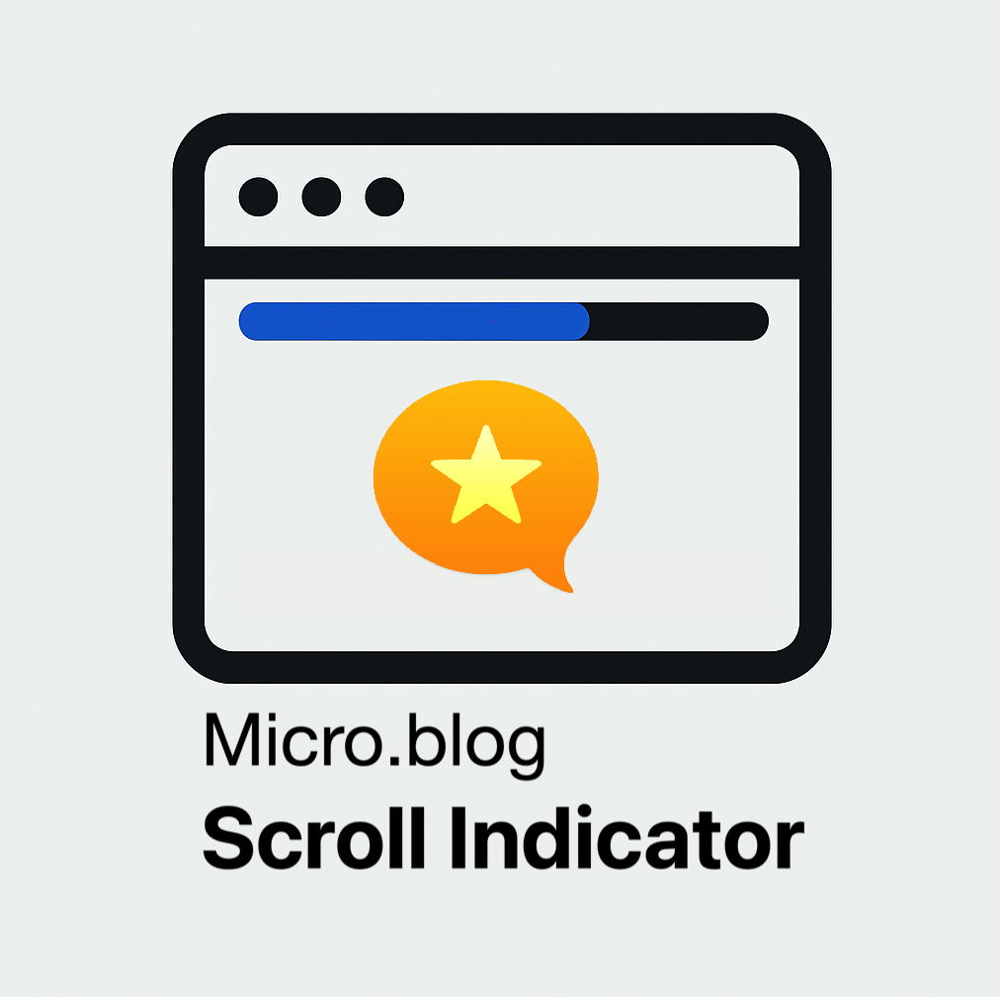

# Scroll Progress Bar for Micro.blog

This Micro.blog plugin adds a simple scroll progress indicator to your blog. It displays a horizontal bar at the top of the screen that fills up as the user scrolls down the page.

## Features
- Customizable bar color
- Adjustable bar height
- Toggle to enable/disable the bar

## Settings
- Enable or disable the scroll progress bar
- Progress bar color in HEX format
- Height of the progress bar

## How it Works
The plugin injects CSS into the `<head>` and JavaScript into the `<footer>` of your Micro.blog theme. As users scroll down the page, the JavaScript calculates the scroll percentage and adjusts the width of the bar in real-time.

## 👤 Author
René Fischer – [https://fischr.org](https://fischr.org)